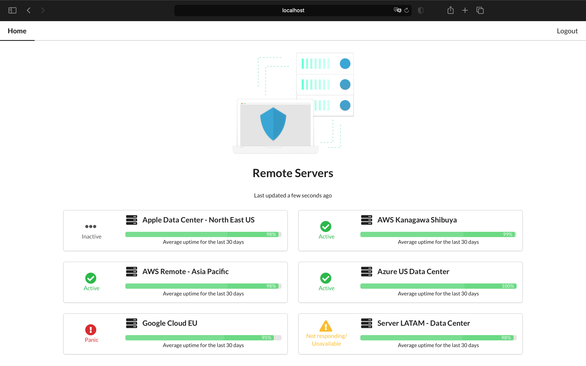

# ServerStatus

A full stack application for remote server management.



## About

This project is a full stack web app that allows system administrators to verify remote server status and perform certain operations on them.

### Used technologies and libraries

- React.JS
- ExpressJS
- TypeScript
- PostgreSQL
- Leaflet JS
- Semantic UI

## Guidelines for running the app

### Setting up PostgreSQL

Install PostgreSQL and enable the `postgresql` service (eg. using Homebrew), run `psql postgres` in Terminal. Once in `psql`, run:

```
> CREATE ROLE serverstatus WITH LOGIN PASSWORD 'serverstatus-local';
> ALTER ROLE serverstatus CREATEDB;
> \q
```

After exiting the `psql` interface, run it again, but using the user you just created:

### `psql -d postgres -U serverstatus`

Then, run:

```
> CREATE DATABASE coffeebrain;
> \q
```

For adding the data model and populating the database run the following command in the project's root directory:

## `yarn run setup-db`

### Installing dependencies

In the root directory of the project run:

### `yarn`
for installing the project dependencies.

### `yarn start`

Runs the Express server and React app in the development mode.

Open [http://localhost:3000](http://localhost:3000) to view it in the browser.
The server runs at [http://localhost:8000](http://localhost:8000) and the API routes can be found under `./server/server.ts`.

The page will reload if you make edits.\
You will also see any lint errors in the console.

### `yarn test`

Launches the test runner in the interactive watch mode.\
See the section about [running tests](https://facebook.github.io/create-react-app/docs/running-tests) for more information.

### `yarn build`

Builds the app for production to the `build` folder.\
It correctly bundles React in production mode and optimizes the build for the best performance.

The build is minified and the filenames include the hashes.\
Your app is ready to be deployed!

See the section about [deployment](https://facebook.github.io/create-react-app/docs/deployment) for more information.

### `yarn eject`

**Note: this is a one-way operation. Once you `eject`, you can’t go back!**

If you aren’t satisfied with the build tool and configuration choices, you can `eject` at any time. This command will remove the single build dependency from your project.

Instead, it will copy all the configuration files and the transitive dependencies (webpack, Babel, ESLint, etc) right into your project so you have full control over them. All of the commands except `eject` will still work, but they will point to the copied scripts so you can tweak them. At this point you’re on your own.

You don’t have to ever use `eject`. The curated feature set is suitable for small and middle deployments, and you shouldn’t feel obligated to use this feature. However we understand that this tool wouldn’t be useful if you couldn’t customize it when you are ready for it.